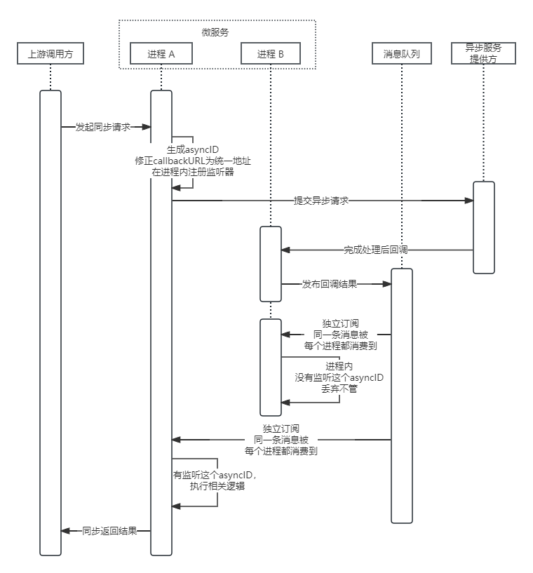

将下游基于回调的异步能力，转为同步请求

# 时序图


# 示例代码
``` golang
package tosync

import (
	"context"
)

func example() {
	ctx := context.Background()
	type SubmitReq struct {
		// 提交异步请求的入参
	}
	type SubmitResp struct{
		// 提交异步请求的返回值
	}
	type Resp struct {
		// 原来callback接口的入参
	}
	req := new(SubmitReq) // TODO 需要给req补充callbackURL的处理函数
	finalResp, err := ToSync[*SubmitReq, *Resp](ctx, req, func(ctx context.Context, req *SubmitReq) error {
		var resp SubmitResp
		resp, err := SubmitTask(ctx, req)
		if err != nil {
			return err
		}
		_ = resp // TODO 解析错误信息，转换为error
		return err
	})
	if err != nil {
		// TODO 处理错误
	}
	_ = finalResp // TODO 这个finalResp就是回调的结果
}

```